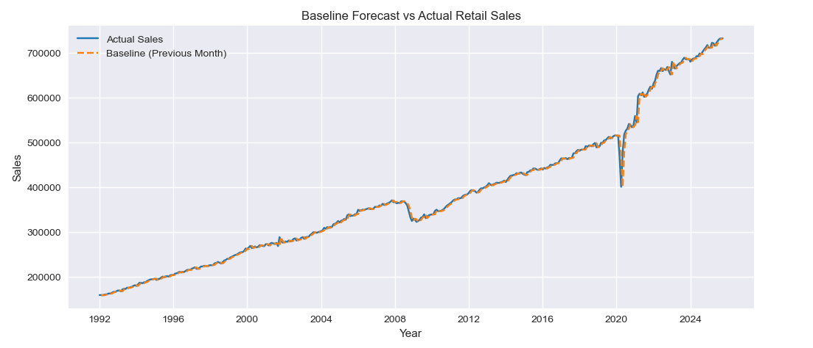

# Time-Series Revenue Forecasting Analysis
**Developed by: Navis Zuhud**

## Project Overview
This project focuses on predicting future consumer spending trends using the Advance Retail Sales dataset from the Federal Reserve Economic Data (FRED). I applied time-series modeling to handle seasonality and economic fluctuations.

## Features
- DATE: Monthly timestamp
- RSAFS: Advance Retail Sales (Millions of Dollars)
- Seasonality: Adjusted indicators
- Category: Retail Trade and Food Services classification

## Key Features & Insights
- Trend Identification: Analyzed 30+ years of retail data to identify long-term growth patterns.
- Seasonal Adjustments: Used statistical methods to account for holiday spending spikes (e.g., December peaks).
- Model Accuracy: Developed a forecasting model to project revenue for the upcoming 12-month cycle.
- Business Impact: Provides stakeholders with a data-driven outlook for inventory and budget planning.

## Visual Output Sample

## Tech Stack
- Language: Python
- Libraries: Pandas, Statsmodels, Matplotlib
- Source: FRED (Federal Reserve Economic Data)
